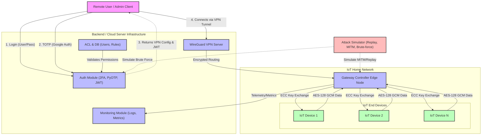

# Two-Phase Authentication and VPN-Based Secured Communication for IoT Home Networks

This system architecture is designed for an implementation-ready, gateway-centric IoT network. It separates concerns between centralized authentication/VPN provisioning and localized IoT device management.

## 1. Architecture Diagram (Textual & Flow)



## 2. Components

### A. Backend Server (Central Hub)
*   **Auth Module**: Handles Phase 1 (Username/Password via Bcrypt) and Phase 2 (TOTP verification). Issues short-lived JWTs and triggers VPN config generation.
*   **ACL & Access Control**: Validates incoming VPN and API requests to ensure the connected identity actually has permission to communicate with specific IoT endpoints.
*   **VPN Manager**: Dynamically configures the WireGuard server (adding/removing peers based on active sessions).

### B. Gateway Controller (Edge Hub)
*   Provides the *only* bridge into the local IoT network.
*   **VPN Client**: Autonomously links back to the Backend Server over a persistent WireGuard tunnel.
*   **IoT Router**: Serves as a localized proxy. Validates ACL contexts passed through the tunnel before relaying commands to end devices.
*   **Crypto Delegate**: Manages the local ECC key pair per IoT device, managing session keys to keep external encryption isolated from the lightweight local encryption.

### C. IoT Simulator
*   A swarm simulation module representing sensors and actuators.
*   Generates dummy telemetries (temperature, humidity, motion).
*   Implements the lightweight crypto requirements natively.

### D. VPN Module (WireGuard)
*   Provides Layer 3 encrypted routing using ChaCha20-Poly1305.
*   Highly performant, state-of-the-art tunnel setup with minimal footprint, perfectly suited for extending to edge gateways.

### E. Attack Simulator
*   **Brute-force login**: Python scripts iterating through password dictionaries against the Auth module.
*   **MITM**: Scapy-based script attempting to intercept the AES-128 communication between the Gateway and IoT simulator.
*   **Replay Attack**: Captured payload resubmission script, designed to be thwarted by nonces or sequence numbers in the protocol.

## 3. Tech Stack (Implementation Ready)

*   **Programming Language**: Python 3.11+
*   **Web Framework**: FastAPI (High performance, async, built-in validation for Backend & Gateway API).
*   **Authentication**: `passlib` (bcrypt) for Phase 1, `pyotp` for Phase 2 TOTP, `PyJWT` for session validation.
*   **VPN Engine**: `wireguard-tools` (Managed via `subprocess` or `pywg` wrapper).
*   **Lightweight Crypto**: `cryptography` package (specifically `ECDH` using the SECP256R1 curve for key exchange, and `AESGCM` for 128-bit symmetric encryption).
*   **Database**: SQLite or PostgreSQL (using `SQLAlchemy` ORM) for user records, ACL lists, and device registries.
*   **Attack / Network Tools**: `Scapy` for crafting Replay and MITM traffic.
*   **Monitoring**: `logging` library coupled with a dedicated API endpoint or `prometheus_client` to expose throughput/latency to a standard dashboard.

## 4. Folder Structure

```text
iot_secure_framework/
├── .env                              # Environment vars (Secrets, DB URIs)
├── requirements.txt                  # Python dependencies
├── backend_server/                   # Cloud / Central Controller
│   ├── auth_module/                  # user_pass.py, totp_engine.py
│   ├── vpn_manager/                  # wg_config_generator.py
│   ├── acl_engine/                   # permissions.py
│   ├── models/                       # db_schema.py (Users, ACL)
│   └── main.py                       # FastAPI application
├── gateway_controller/               # Runs on the Gateway Node (e.g., Raspberry Pi)
│   ├── local_vpn_client/             # wg_agent.py
│   ├── device_manager/               # connected_devices.json/Cache
│   ├── rules_enforcer/               # ACL checker proxy
│   └── gateway.py                    # Main edge daemon
├── iot_simulator/                    # Simulates Edge Devices
│   ├── crypto_unit/                  
│   │   ├── ecc_exchange.py           # ECC Key agreement solver
│   │   └── aes_128.py                # Wrapper for AES-GCM
│   ├── sensors.py                    # Generates dummy data
│   └── swarm_runner.py               # Spawns test devices via threading
├── attack_simulator/                 # Threat Emulation Tools
│   ├── brute_force.py                # Auth smashing script
│   ├── mitm_sniff.py                 # Scapy traffic interceptor
│   └── replay_attack.py              # Packet resender
└── monitoring/                       # Metrics
    ├── logger_config.py              # Central format
    └── metrics.py                    # Throughput/Latency calculation
```

## 5. Data Flow Explanation

1.  **System Initialization & Setup**:
    *   The **Gateway Controller** boots up, establishes an outbound WireGuard VPN connection to the **Backend Server**.
    *   **IoT Devices (Simulator)** boot up, perform an ECC (Elliptic Curve Cryptography) Diffie-Hellman cryptographic handshake with the Gateway. The result is a securely shared AES-128 symmetric key unique to each device. *No IoT devices are accessible directly from the internet.*
2.  **Authentication (The User Experience)**:
    *   A User attempts to access a temperature sensor via their client app.
    *   *Phase 1*: They hit the Backend Server's login endpoint (`/auth/login`) with username/password.
    *   *Phase 2*: Upon valid password, they are challenged for a TOTP code (`/auth/verify_totp`).
    *   Upon success, the Backend Server issues a signed JWT, updates the WireGuard peer list to allow the User's IP, and provides a VPN config to the User.
3.  **VPN & Authorization (Secured Tunneling)**:
    *   The User activates the WireGuard tunnel. Their IP traffic is now secure to the Backend Server.
    *   The User sends a command targeting the IoT Device (e.g., `TURN_ON_LIGHT`), encapsulating their JWT token.
    *   The Backend verifies the JWT, checks the **ACL Module** to ensure the User has permissions for `Device X`, and routes the approved instruction down its existing Gateway VPN tunnel.
4.  **Gateway Data Execution**:
    *   The Gateway receives the command from the authenticated cloud tunnel.
    *   It retrieves the shared AES-128 key for `Device X`.
    *   It encrypts the payload (`TURN_ON_LIGHT`) adding a nonce/timestamp, and sends it to `Device X`.
5.  **Monitoring & Defense**:
    *   The **Attack Simulator** launches a *Replay Attack*, intercepting local traffic and re-sending the locally encrypted command. The Gateway drops the replicated packet because the nonce/sequence number has already been used.
    *   Throughput and cryptographic processing latency are continuously pushed by the Gateway to the **Monitoring Module**.
