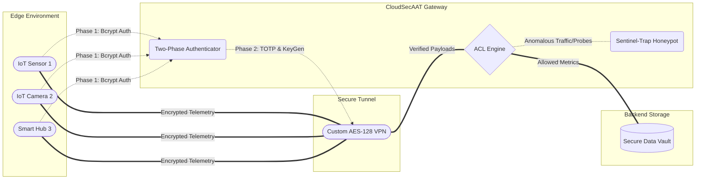

# System Architecture Diagram

```mermaid
flowchart LR
    %% Define Styles
    classDef device fill:#473472,stroke:#000,stroke-width:2px,color:#fff
    classDef vpn fill:#87BAC3,stroke:#000,stroke-width:2px,color:#000
    classDef gateway fill:#53629E,stroke:#000,stroke-width:2px,color:#fff
    classDef vault fill:#D6F4ED,stroke:#000,stroke-width:2px,color:#000
    classDef honeypot fill:#e74c3c,stroke:#000,stroke-width:2px,color:#fff

    %% Nodes
    subgraph Edge Environment
        D1([IoT Sensor 1])::::device
        D2([IoT Camera 2])::::device
        D3([Smart Hub 3])::::device
    end

    subgraph Secure Tunnel
        VPN([Custom AES-128 VPN])::::vpn
    end

    subgraph CloudSecAAT Gateway
        Auth(Two-Phase Authenticator)::::gateway
        ACL{ACL Engine}::::gateway
        Sentinel(Sentinel-Trap Honeypot)::::honeypot
    end

    subgraph Backend Storage
        Vault[(Secure Data Vault)]::::vault
    end

    %% Connections
    D1 -.->|Phase 1: Bcrypt Auth| Auth
    D2 -.->|Phase 1: Bcrypt Auth| Auth
    D3 -.->|Phase 1: Bcrypt Auth| Auth

    Auth -.->|Phase 2: TOTP & KeyGen| VPN
    
    D1 ===|Encrypted Telemetry| VPN
    D2 ===|Encrypted Telemetry| VPN
    D3 ===|Encrypted Telemetry| VPN

    VPN ===|Verified Payloads| ACL

    ACL ===|Allowed Metrics| Vault
    ACL -.-|Anomalous Traffic/Probes| Sentinel
```
