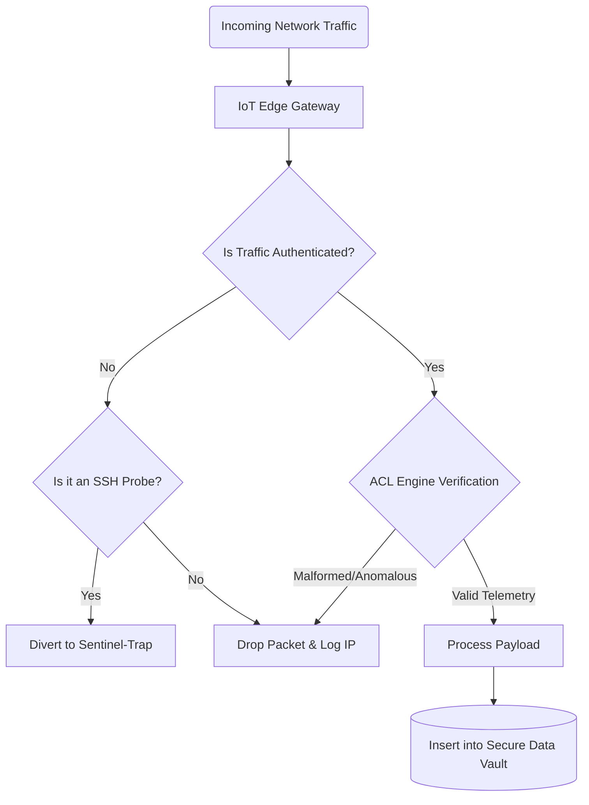

# Traffic Flow & ACL Routing

```mermaid
flowchart TD
    %% Define Styles
    classDef input fill:#87BAC3,stroke:#000,stroke-width:2px,color:#000
    classDef process fill:#53629E,stroke:#000,stroke-width:2px,color:#fff
    classDef vault fill:#D6F4ED,stroke:#000,stroke-width:2px,color:#000
    classDef honeypot fill:#e74c3c,stroke:#000,stroke-width:2px,color:#fff
    classDef drop fill:#555,stroke:#000,stroke-width:2px,color:#fff

    %% Flow
    In(Incoming Network Traffic)::::input --> G[IoT Edge Gateway]::::process
    
    G --> Check{Is Traffic Authenticated?}::::process
    
    Check -->|No| Probes{Is it an SSH Probe?}::::process
    Probes -->|Yes| Trap[Divert to Sentinel-Trap]::::honeypot
    Probes -->|No| Block[Drop Packet & Log IP]::::drop

    Check -->|Yes| ACL{ACL Engine Verification}::::process
    
    ACL -->|Valid Telemetry| Clean[Process Payload]::::process
    ACL -->|Malformed/Anomalous| Block
    
    Clean --> Store[(Insert into Secure Data Vault)]::::vault
```
